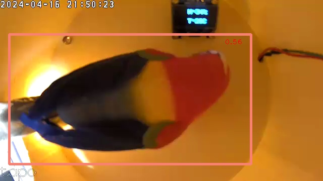
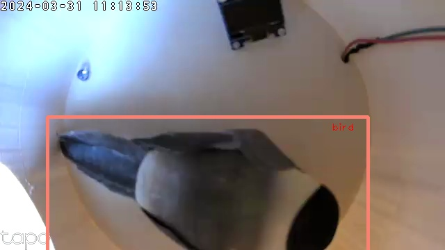
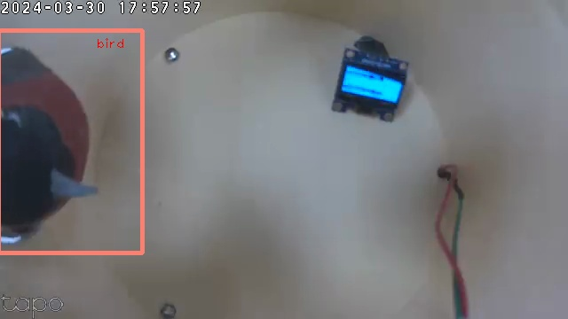
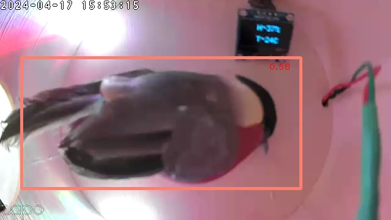

# Проект умная кормушка с функцией удалённого мониторинга за птицами

Данный проект представляет собой нейронную сеть для обнаружения птиц с последующей отправкой изображения с найденными объектами на Яндекс Диск. Проект реализован на ЯП Python.

## Для запуска локально требуется:
- Версия Python от 3.7.0 до 3.7.9;
- любая linux подобная система ( в моём случае реализация была на RaspberryPi 4 model B+ );
- необходимые библиотеки и зависимости, рекомендованных версий ( OpenCV='3.4.6', TensorflowLite='0.4.3', yadisk );

## Шаги, для запуска проекта локально:
1. Клонирование репозитория:
    > git clone https&#58;//github&#46;com/Lev2307/kormushka_project.git
2. Создание и активация виртуального окружения:
    > python3 -m venv env

    > source env/bin/activate
3. Обновление менеджера пакетов и установка необходимых библиотек:
    > python3 -m pip install --upgrade pip wheel setuptools

    > python3 -m pip install opencv-python==3.4.6 tflite-support==0.4.3 yadisk
4. Запуск:
    > python3 kormushka_project/detect.py

## Примеры полученных изображений из кормушки

